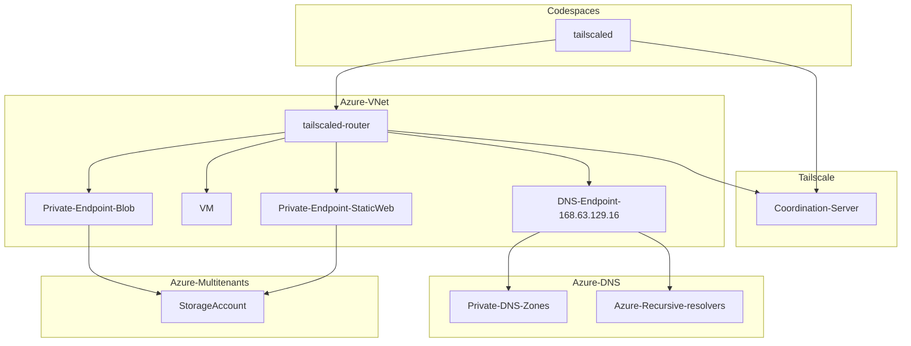

# Connecting GitHub Codespaces and Azure VNet with Tailscale

## Overview

* Sample devcontainer configuration and Terraform HCL for connecting GitHub Codespaces and Azure VNet with Tailscale.
*
* [Subnet routers](https://tailscale.com/kb/1019/subnets/) for Azure VNet
  * No need to install tailscale on each VM in Azure VNet
* [DNS forwarding](https://tailscale.com/kb/1054/dns/) for Azure VM / Private Endpoint name resolution
  * No need to remember the IP addresses to access VMs and Private Endpoints from Codespaces

## Notes

### Authorization

To allow Codespaces to join tailnet, you have to pass TAILSCALE_AUTHKEY. Storing a reusable auth key in Codespaces Secret is an easy way.

> [Access your tailnet from GitHub Codespaces](https://tailscale.com/kb/1160/github-codespaces/)

And, for subnet router, this sample pass a key as Terraform variables. Choose your preferred method, such as interactive or environment variables.

### Enabling subnet routes

[Enable subnet routes from the admin console](https://tailscale.com/kb/1019/subnets/) after setup subnet router.

### Azure VM / Private Endpoint DNS configuration

[Add nameservrers in Tailscale](https://tailscale.com/kb/1054/dns/) settings for forwarding. For examaple, you have to add the following nameservers to get this sample work

* internal.cloudapp.net (168.63.129.16)
* web.core.windows.net (168.63.129.16)
* blob.core.windows.net (168.63.129.16)

See below for other zones

> [Azure Private Endpoint DNS configuration](https://docs.microsoft.com/en-us/azure/private-link/private-endpoint-dns)

### Addtional references

> [Access Azure Linux VMs privately using Tailscale](https://tailscale.com/kb/1142/cloud-azure-linux/)
